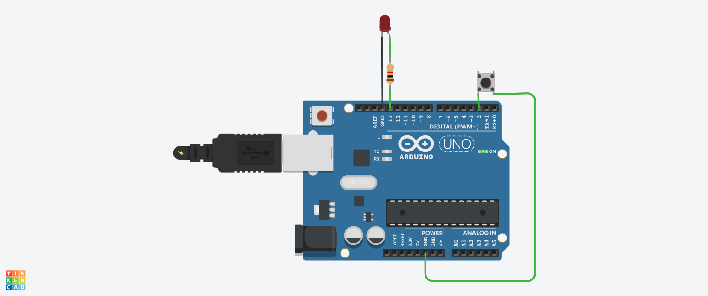

# Button Controlled LED using Arduino

## Objective
To control an LED using a push button by reading digital input from Arduino.

## Components Used
- Arduino Uno  
- LED  
- Resistor  
- Push Button  

## Working Principle
The Arduino reads the state of the button using digital input. When the button is pressed, the signal becomes LOW (due to INPUT_PULLUP), and the LED turns ON. When released, the LED turns OFF.

## Circuit Diagram / Output


## Code
```cpp
int buttonPin = 2;
int ledPin = 13;

void setup() {
  pinMode(buttonPin, INPUT_PULLUP);
  pinMode(ledPin, OUTPUT);
}

void loop() {
  int buttonState = digitalRead(buttonPin);

  if(buttonState == LOW) {
    digitalWrite(ledPin, HIGH);
  } else {
    digitalWrite(ledPin, LOW);
  }
}
