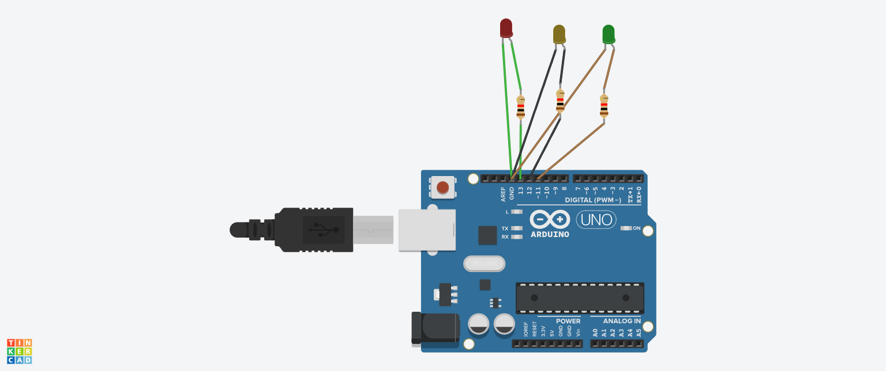

# Traffic Light System using Arduino

## Objective
To simulate a traffic signal using 3 LEDs.

## Components Used
- Arduino Uno
- Red LED
- Yellow LED
- Green LED
- Resistors

## Working Principle
The LEDs turn ON one after another like a real traffic signal:
Red → Yellow → Green.

## Circuit Diagram / Output


## Code
```cpp
int red = 13;
int yellow = 12;
int green = 11;

void setup() {
  pinMode(red, OUTPUT);
  pinMode(yellow, OUTPUT);
  pinMode(green, OUTPUT);
}

void loop() {
  digitalWrite(red, HIGH);
  digitalWrite(yellow, LOW);
  digitalWrite(green, LOW);
  delay(3000);

  digitalWrite(red, LOW);
  digitalWrite(yellow, HIGH);
  digitalWrite(green, LOW);
  delay(1000);

  digitalWrite(red, LOW);
  digitalWrite(yellow, LOW);
  digitalWrite(green, HIGH);
  delay(3000);
}
