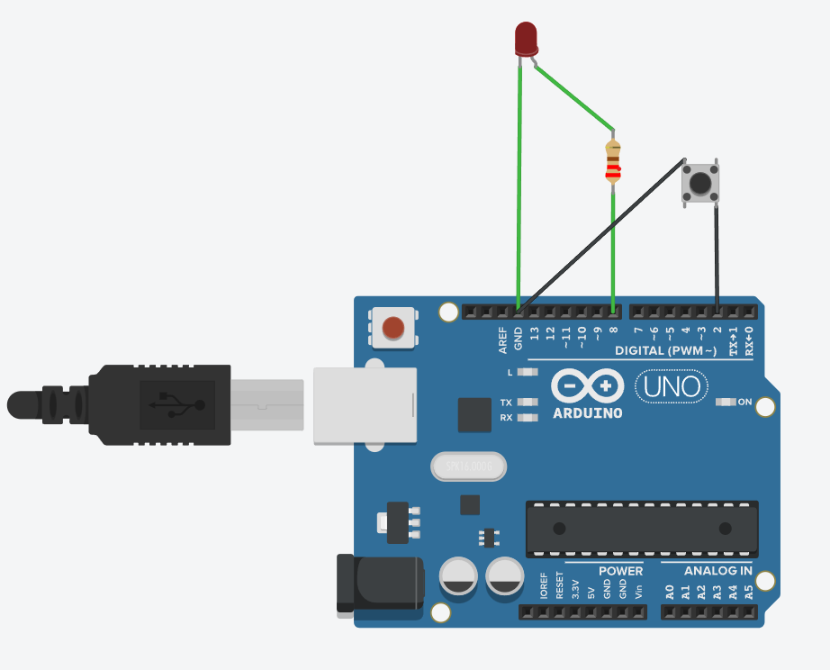

# Button Toggle LED

## Objective
To toggle an LED using a push button.

## Components Used
- Arduino UNO  
- LED  
- Resistor  
- Push Button  

## Working Principle
Each button press changes the LED state (ON ↔ OFF) using toggle logic.

## Circuit Diagram / Output


## Code
```cpp
int led = 8;
int button = 2;

bool ledState = false;
bool lastButtonState = HIGH;

void setup() {
  pinMode(led, OUTPUT);
  pinMode(button, INPUT_PULLUP);
}

void loop() {
  bool currentButtonState = digitalRead(button);

  if (lastButtonState == HIGH && currentButtonState == LOW) {
    ledState = !ledState;
    digitalWrite(led, ledState);
    delay(200);
  }

  lastButtonState = currentButtonState;
}
