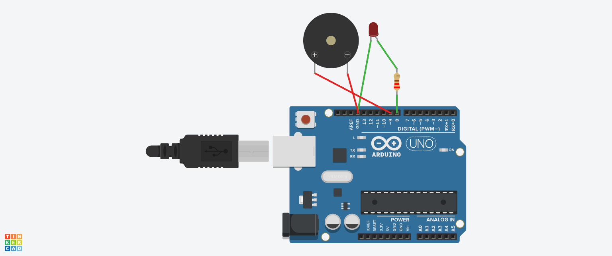

# Buzzer + LED Alert System

## Objective
To control a buzzer and LED together using Arduino.

## Components Used
- Arduino UNO  
- LED  
- Resistor  
- Buzzer  

## Working Principle
When Arduino sends HIGH signal, both LED and buzzer turn ON.  
When LOW signal is sent, both turn OFF.

## Circuit Diagram / Output


## Code
```cpp
int led = 8;
int buzzer = 9;

void setup() {
  pinMode(led, OUTPUT);
  pinMode(buzzer, OUTPUT);
}

void loop() {
  digitalWrite(led, HIGH);
  digitalWrite(buzzer, HIGH);
  delay(1000);

  digitalWrite(led, LOW);
  digitalWrite(buzzer, LOW);
  delay(1000);
}
