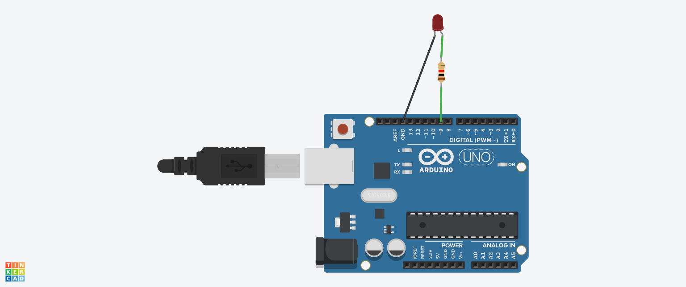

# LED Fading using Arduino

## Objective
To control LED brightness using PWM.

## Components Used
- Arduino Uno
- LED
- Resistor

## Working Principle
The Arduino uses PWM (Pulse Width Modulation) to vary LED brightness.

## Circuit Diagram / Output


## Code
```cpp
int ledPin = 9;

void setup() {
  pinMode(ledPin, OUTPUT);
}

void loop() {
  for(int i = 0; i <= 255; i++) {
    analogWrite(ledPin, i);
    delay(10);
  }

  for(int i = 255; i >= 0; i--) {
    analogWrite(ledPin, i);
    delay(10);
  }
}
