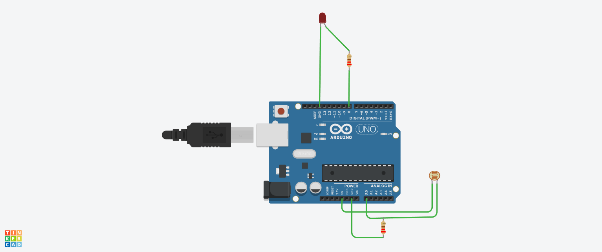

# Light Sensor LED (Automatic Light Control)

## Objective
To turn ON LED in darkness and OFF in light automatically.

## Components Used
- Arduino UNO  
- LED  
- Resistor  
- LDR (Photoresistor)  

## Working Principle
The LDR senses light intensity and sends values to Arduino.  
If it is dark, LED turns ON. If it is bright, LED turns OFF.

## Circuit Diagram / Output


## Code
```cpp
int led = 8;
int sensor = A0;

void setup() {
  pinMode(led, OUTPUT);
}

void loop() {
  int value = analogRead(sensor);

  if(value < 500) {
    digitalWrite(led, HIGH);
  } else {
    digitalWrite(led, LOW);
  }
}
