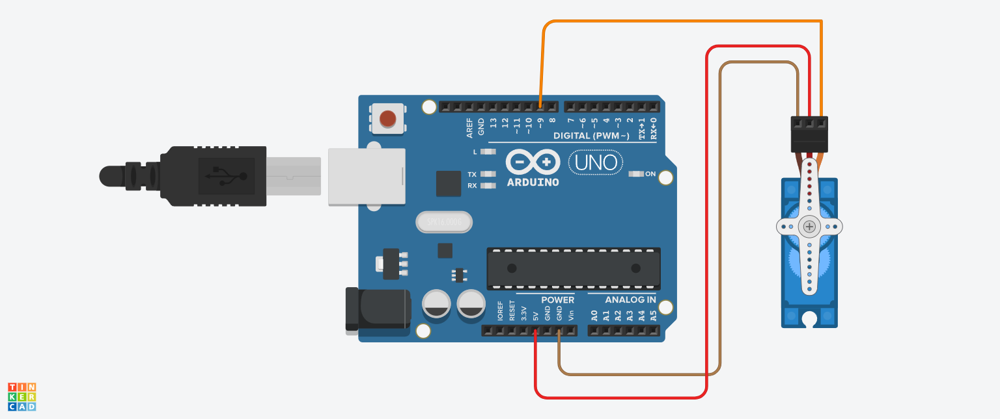

# Servo Motor Control using Arduino

## Objective
To control a servo motor and rotate it to different angles.

## Components Used
- Arduino UNO  
- Servo Motor (SG90)  

## Working Principle
The servo motor rotates based on angle commands given by Arduino using the Servo library.

## Circuit Diagram / Output


## Code
```cpp
#include <Servo.h>

Servo myServo;

void setup() {
  myServo.attach(9);
}

void loop() {
  myServo.write(0);
  delay(1000);

  myServo.write(90);
  delay(1000);

  myServo.write(180);
  delay(1000);
}
