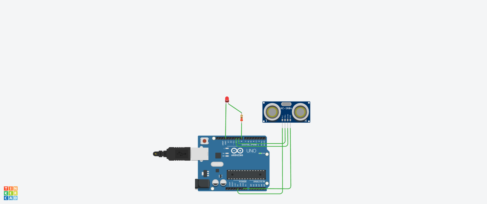

# Ultrasonic Distance Sensor with LED

## Objective
To turn ON LED when an object is near and OFF when it is far.

## Components Used
- Arduino UNO  
- Ultrasonic Sensor (HC-SR04)  
- LED  
- Resistor  

## Working Principle
The ultrasonic sensor measures distance using sound waves.  
If the object is near, LED turns ON. If far, LED turns OFF.

## Circuit Diagram / Output


## Code
```cpp
int trig = 9;
int echo = 10;
int led = 8;

void setup() {
  pinMode(trig, OUTPUT);
  pinMode(echo, INPUT);
  pinMode(led, OUTPUT);
}

void loop() {
  long duration;
  int distance;

  digitalWrite(trig, LOW);
  delayMicroseconds(2);

  digitalWrite(trig, HIGH);
  delayMicroseconds(10);
  digitalWrite(trig, LOW);

  duration = pulseIn(echo, HIGH);

  distance = duration * 0.034 / 2;

  if(distance < 20) {
    digitalWrite(led, HIGH);
  } else {
    digitalWrite(led, LOW);
  }
}
